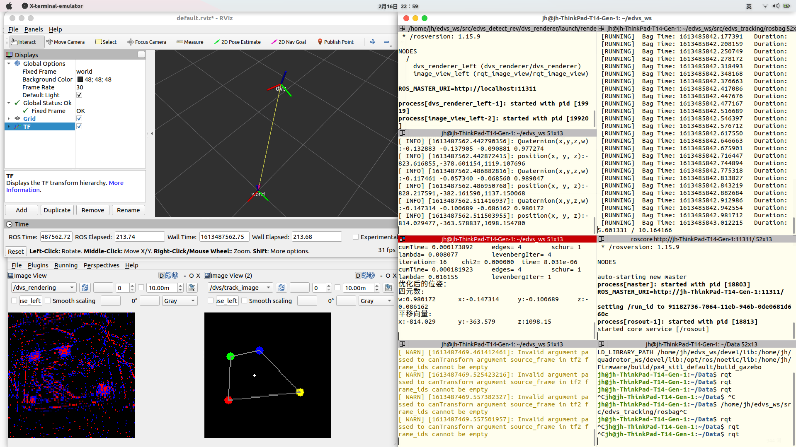

# 基于事件相机的频闪LED标记点位姿追踪

---

## 概述

该代码利用事件相机对频闪LED标记点进行追踪，事件流数据经过频率滤波、聚类、Pnp位姿估计、BA（Bundle Adjustmen）优化并估计出位姿pose，可在低光环境下进行无人机姿态追踪实现定点降落，[演示视频](https://www.bilibili.com/video/BV1Go4y197gr)。

其流程：


数据处理：


论文：[*Method of pose tracking by event camera using LED marker points*](https://ieeexplore.ieee.org/document/9101448/)

实验硬件设备：

- 事件相机：[edvs-4337](https://inivation.com/hardware/)

- 频闪LED：四个LED灯，由Arduino UNO控制，每个LED的闪烁频率为500HZ，摆放位置为梯形（非完全对称多边形即可，该示例算法基于多边形的形心与各特征点的距离来寻找对应关系，算法会随LED标记点放置的多边形形状特征而改变），相对位置如图所示。

  

---

## 算法包示例

### 系统要求
该实验基于Ubuntu20.04 ROS Noetic版本，也可应用于Ubuntu18.04(Melodic)和Ubuntu16.04(Kinetic)。  

安装算法包步骤：

1. 安装libcaer（事件相机DVS、eDVS、Davis、Dynap-SE的驱动C库）

   其依赖有：

   - pkg-config
   - cmake >= 2.6
   - gcc >= 4.9 or clang >= 3.6
   - libusb >= 1.0.17
   - 可选: libserialport >= 0.1.1
   - 可选: Opencv >= 3.1.0 

   libserialport需要下载安装，其余依赖均可以用apt安装：

   ~~~shell
   sudo apt-get install build-essential cmake pkg-config libusb-1.0-0-dev
   ~~~

   libserialpor安装：

   ~~~shell
   git clone https://github.com/martinling/libserialport.git
   cd ~/libserialport
   sudo apt-get install dh-autoreconf
   ./autogen.sh
   ./configure
   sudo make install
   ~~~

   安装libcaer：

   ~~~shell
   git clone https://github.com/inivation/libcaer.git
   cd ~/libcaer
   mkdir build
   cd build
   cmake -DCMAKE_INSTALL_PREFIX=/usr -DENABLE_SERIALDEV=1 -DENABLE_OPENCV=1 ..
   make
   sudo make install
   ~~~

2. 添加对libcaer的支持串口规则：

   ```shell
   cd /etc/udev/rules.d
   sudo gedit 65-inivation.rules 
   ```

   在65-inivation.rules文件中添加

   ```
   # All DVS/DAVIS/Dynap-SE systems
   SUBSYSTEM=="usb", ATTR{idVendor}=="152a", ATTR{idProduct}=="84[0-1]?", MODE="0666"
   # eDVS 4337
   SUBSYSTEM=="usb", ATTR{idVendor}=="0403", ATTR{idProduct}=="6014", MODE="0666"
   ```

   若需要修改串口权限，通过修改udev规则即可。

   编辑文件:

   ```shell
   sudo gedit /etc/udev/rules.d/70-snap.core.rules  #或者sudo gedit /etc/udev/rules.d/70-ttyusb.rules
   ```

   增加一行：

   ```
   KERNEL=="ttyUSB[0-9]*", MODE="0666"
   ```

   保存后，重新加载udev规则

   ```shell
   sudo udevadm control --reload-rules
   sudo udevadm trigger
   ```

   此时可应用libcaer/example中eDVS例子进行读取。

3. 安装Sophus库（李群与李代数，描述位姿SO3空间）

   ~~~shell
   git clone https://github.com/strasdat/Sophus.git
   cd Sophus/
   mkdir build
   cd build
   cmake ..
   make
   sudo make install
   ~~~

4. 安装g2o库依赖（优化Pnp估计位姿数据）

   ~~~shell
   sudo apt-get install libsuitesparse-dev qtdeclarative5-dev qt5-qmake libqglviewer-headers
   git clone https://github.com/koide3/g2o.git
   cd g2o
   git checkout hdl_graph_slam
   mkdir build && cd build
   cmake .. -DCMAKE_BUILD_TYPE=RELEASE
   make -j4
   sudo make install
   ~~~

5. 安装[ROS](http://wiki.ros.org/cn/ROS/Installation)

6. 下载编译算法包

   ~~~shell
   mkdir -p ~/dvs_tracking_ws/src
   cd ~/dvs_tracking_ws/src
   git clone https://github.com/Xujianhong123Allen/edvs_tracking
   ~~~

   使用`catkin build`命令进行编译，在ROS Noetic版本中使用的python3，以前版本为python2，使用以下命令安装

   ~~~shell
   # 如果是Ubuntu20.04，python3
   sudo apt install python3-catkin-tools python3-osrf-pycommon
   # 如果是Ubuntu18.04以前版本，python2
   sudo apt install python-catkin-tools
   ~~~

   ~~~shell
   cd ~/dvs_tracking_ws
   catkin build
   source devel/setup.bash
   ~~~

7. 运行程序

   - 使用该网站提供rosbag录制的dvs事件数据包，并运行算法包检测位姿

     运行程序：

     启动渲染器

     ~~~shell
     roslaunch dvs_renderer renderer_mono.launch
     ~~~

     新开终端，运行数据包、检测位姿、rviz仿真节点

     ~~~shell
     cd ~/dvs_tracking_ws/src/rosbag
     rosbag play -l edvs_leds_simple.bag 
     rosrun tracking tracking
     rqt
     rosrun rviz_simulation rviz_simulation
     rviz
     ~~~

     设置rqt的image_view，找到相应的topic；设置rviz中frame为world，并添加tf坐标。结果如图所示：

     

   - 使用自己的dvs相机：在使用之前需要完成以下步骤

     - 构建自己的频闪led灯标记点（500HZ以上），并确定其世界坐标的相对位置，在[文件](tracking/src/tracking.cpp)中修改。
     - 对dvs进行标定，可利用[UZH RPG DVS的参考网站](https://github.com/uzh-rpg/rpg_dvs_ros/blob/master/dvs_calibration/README.md)，标定参数得到的参数*内参矩阵K*和*失真系数D*需要在[文件](tracking/src/tracking.cpp)中修改

     如上述运行程序即可。


